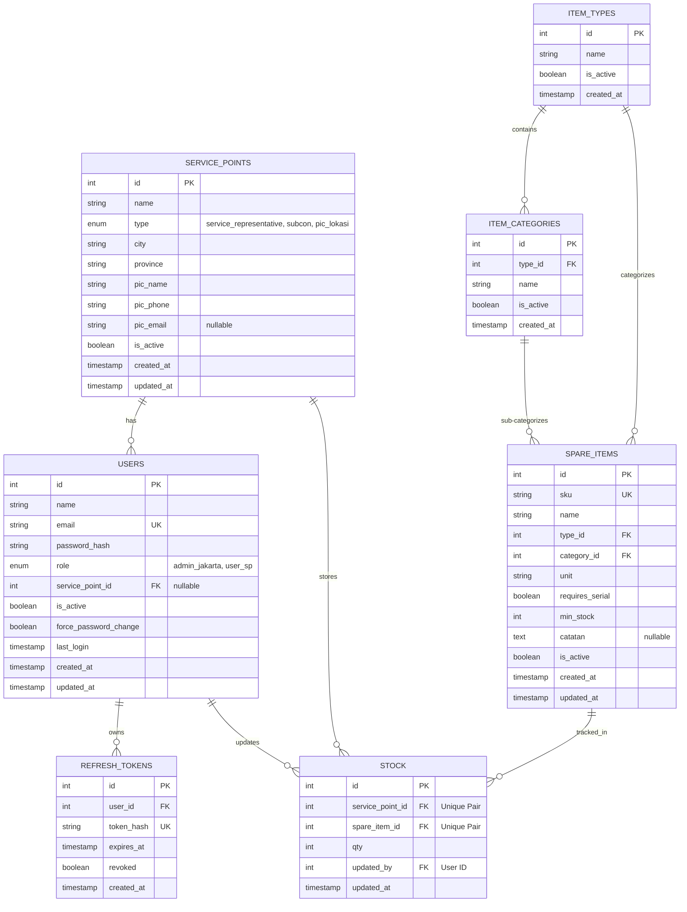

# Entity Relationship Diagram (ERD)

## Penjelasan Relasi
1. **User & Service Point**: User dengan role `user_sp` wajib terhubung ke salah satu `service_points`. Admin Jakarta tidak wajib terhubung.
2. **Refresh Token**: Berelasi 1-to-many dari `users`. Disimpan di database untuk mekanisme revoke token (keamanan tambahan).
3. **Item Type, Category, Spare Item**: Hierarki master data barang. Spare Item terikat pada jenis dan kategori tertentu.
4. **Stock**: Merupakan tabel relasional (many-to-many) antara `service_points` dan `spare_items`. Memiliki Unique Constraint pada kombinasi `(service_point_id, spare_item_id)` untuk mencegah duplikasi baris stok untuk barang yang sama di lokasi yang sama.
